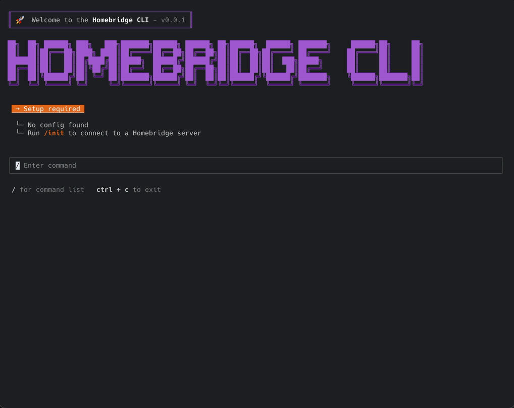

# homebridge-cli

An interactive CLI that allows you to configure and manage [Homebridge] from the terminal.

<br/>

> _**Disclaimer** — This is an unofficial CLI tool, not affiliated with or endorsed by the Homebridge project. It was built out of love for Homebridge — free for anyone to use or modify._
>
> A huge thank you to the Homebridge team and community for all you have built 🙏

<br/>
<br/>

# Docs 📑

- [Install 🚀](#install-)
- [Prerequisites ✅](#prerequisites-)
- [API Unavailable? 🤔](#api-unavailable-)
- [Local Development 👨🏻‍💻](#local-development-)
  - [Getting Started](#getting-started)
  - [Development Build](#development-build)
  - [Production Build](#production-build)
  - [Dependency Management 📦](#dependency-management-)
    - [Options](#options)

<br/>
<br/>

# Install 🚀

> ⚠️ _**WARNING** — Please make sure to follow the [Prerequisites](#prerequisites) section first before installing `homebridge-cli`_

<br/>
<br/>

# Prerequisites ✅

There are only two prerequisites required before you can continue.

- You must be running macOS or Linux
- You must have Node.js `>= v24.13` installed

## Install Node.js

Follow the steps below to install Node.js using [`nvm`] (Node Version Manager)

1. Download and install [`nvm`]
2. Install and use a version of Node.js `>= v24.13`

```sh
$ nvm install 24.13
$ nvm use 24.13
```

3. Verify you are running a version of Node.js `>= v24.13`

```sh
$ node --version
v24.13.0

$ npm --version
v11.6.2
```

Check out their official [installation guide](https://nodejs.org/en/download) for more info.

<br/>
<br/>

# API Unavailable? 🤔

The Homebridge CLI is powered by the same API used by [Homebridge UI] and is therefore required in order to function. Most Homebridge installations already come preconfigured with this by default, however you may have a non-standard setup. If this is the case you will first need to install it.

Check out their official [installation guide](https://github.com/homebridge/homebridge-config-ui-x#installation-instructions) for more info.

<br/>
<br/>

# Local Development 👨🏻‍💻

> ⚠️ _**WARNING** — Please make sure to follow the [Prerequisites](#prerequisites) section first before continuing_

For local development there are two ways to build and start the app depending on your specific needs...

* [Development Build](#development-build) - Should be used when developing the app
* [Production Build](#production-build) - Should be used to simulate how the app will run once packaged for production

## Getting Started

1. Run `corepack enable` to enable [Corepack]
2. You should now be able to use the [`yarn`] package manager which you **MUST** use for this project

> 📝 _**NOTE** - Yarn comes bundled with [Corepack] and is the preferred way to install/manage Yarn. Check out the [Yarn Installation Guide] for more info_

```sh
$ yarn --version
v4.13.0
```

> 📝 _**NOTE** - The current version of Yarn should match the `packageManager` version in the [`package.json`](/package.json)_

3. Run `yarn` in the project root to install dependencies

## Development Build

Run `yarn dev` to start the development build

```sh
$ yarn dev
```

## Production Build

1. Run `yarn build` to build the app for production
2. Run `node dist/main.js` to start the production build

```sh
$ yarn build
$ node dist/main.js
```

## Dependency Management 📦

Managing dependencies is done using `npm-check-updates` under the hood which has the ability to check for new dependency versions and upgrade dependencies to a specified target version.

1. Run `yarn deps` to list upgradable dependencies

### Options

- `--target ${latest | minor | patch}` to scope dependencies to a specific target version
- `--upgrade` to upgrade dependencies
- `--interactive` to choose which dependencies to upgrade in interactive mode

Check out the [`npm-check-updates`] docs or run `yarn ncu --help` for more info.


<br/>
<br/>

[`nvm`]: https://github.com/nvm-sh/nvm
[`yarn`]: https://yarnpkg.com
[Yarn Installation Guide]: https://yarnpkg.com/getting-started/install
[Corepack]: https://nodejs.org/api/corepack.html
[Homebridge]: https://homebridge.io
[Homebridge UI]: https://github.com/homebridge/homebridge-config-ui-x
[`npm-check-updates`]: https://npmjs.com/package/npm-check-updates
